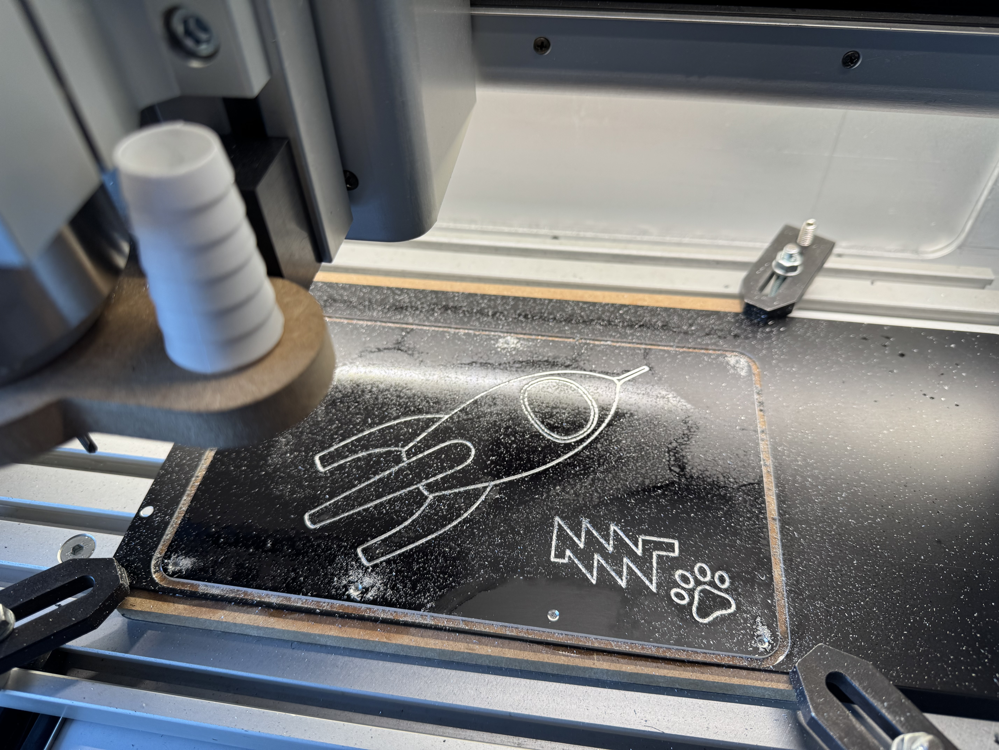
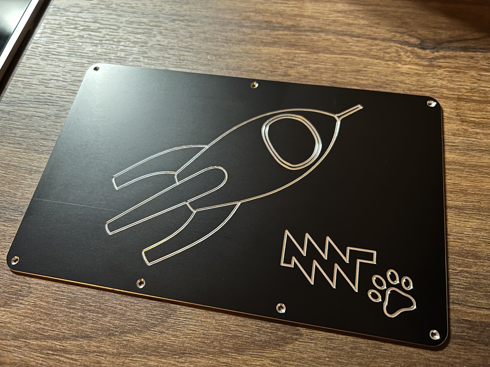
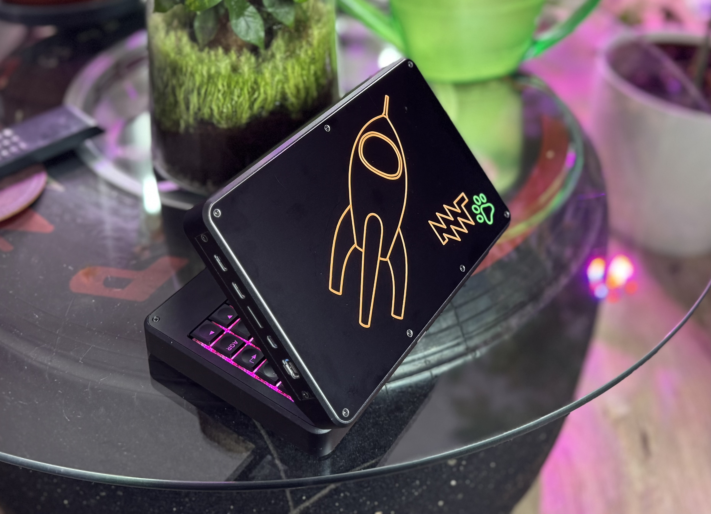

# mnt pocket reform backplate  

 Problem: Factory back plate is made from FR4 PCB base material with poor thermal conductivity.  
 Solution: Back plate made from same thickness aluminum plate. Black anodizing with colored engravings for better looks. 
     
   
 
 
  