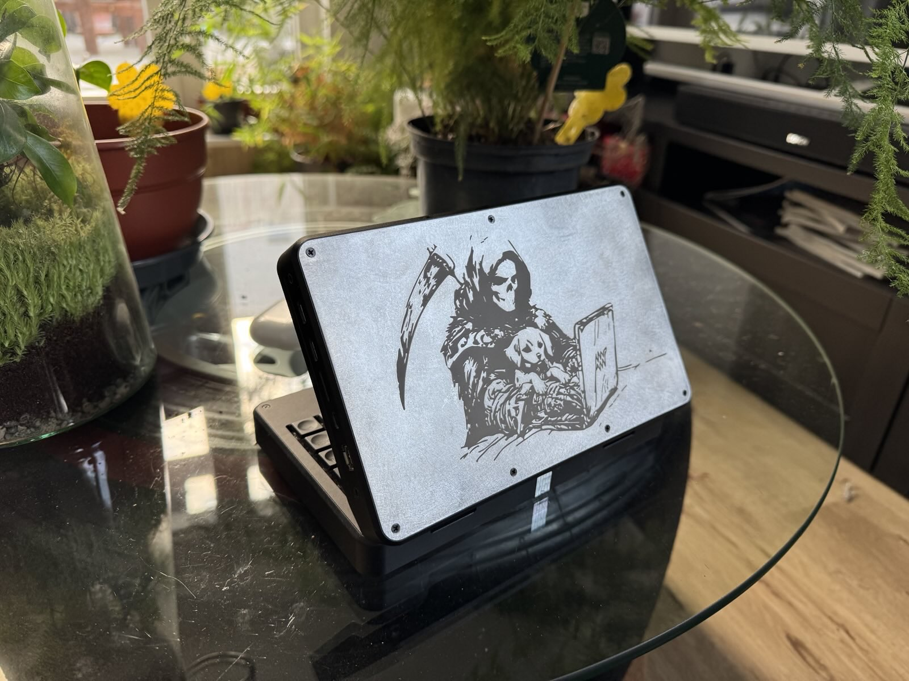

# mnt pocket reform backplate  

 Problem: Factory back plate is made from FR4 PCB base material with poor thermal conductivity.  
 Solution: Back plate made from same thickness material with better conductivity.
     
 Variant 1:  
 Black anodizing with colored engravings for better looks. Made with my CNC machine at home.  
   
  
  
  
Variant 2:  
Made by jlccnc.  
  
  
  
